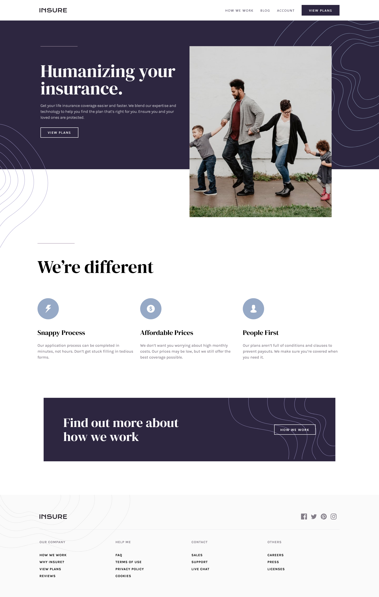

# Frontend Mentor - Insure landing page

# Frontend Mentor - Project tracking intro component solution

This is a solution to the [Insure landing page challenge on Frontend Mentor](https://www.frontendmentor.io/challenges/insure-landing-page-uTU68JV8). Frontend Mentor challenges help you improve your coding skills by building realistic projects. 

## Table of contents

- [Overview](#overview)
  - [Screenshot](#screenshot)
  - [Links](#links)
- [My process](#my-process)
  - [Built with](#built-with)
- [Author](#author)
- [Acknowledgments](#acknowledgments)

## Overview

### The challenge

Users should be able to:

- View the optimal layout for the site depending on their device's screen size
- See hover states for all interactive elements on the page

### Screenshot

### Links

- Solution URL: [Solution on Front-end Mentor Website](https://your-solution-url.com)
- Live Site URL: [Live site](https://danielmrz-dev.github.io/insure-landing-page/src/)

## My process

### Built with

- Semantic HTML5 markup
- TailwindCSS
- Flexbox
- Grid
- Mobile-first workflow
- JavaScript

## Author

- Frontend Mentor - [@danielmrz-dev](https://www.frontendmentor.io/profile/danielmrz-dev)
- Twitter - [@danielmrz_dev](https://www.twitter.com/danielmrz_dev)
